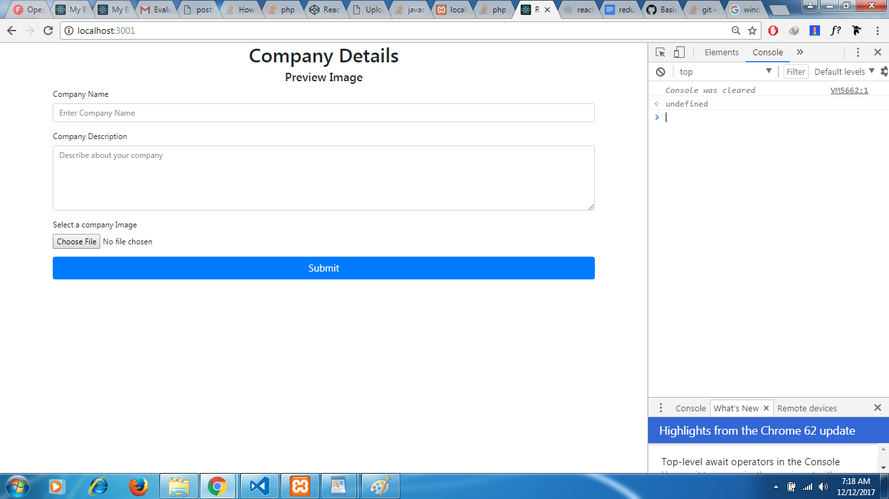
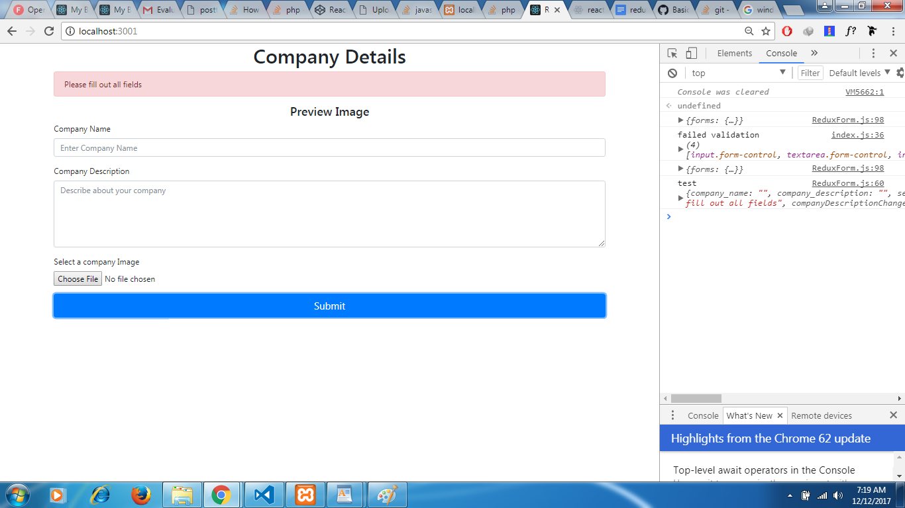
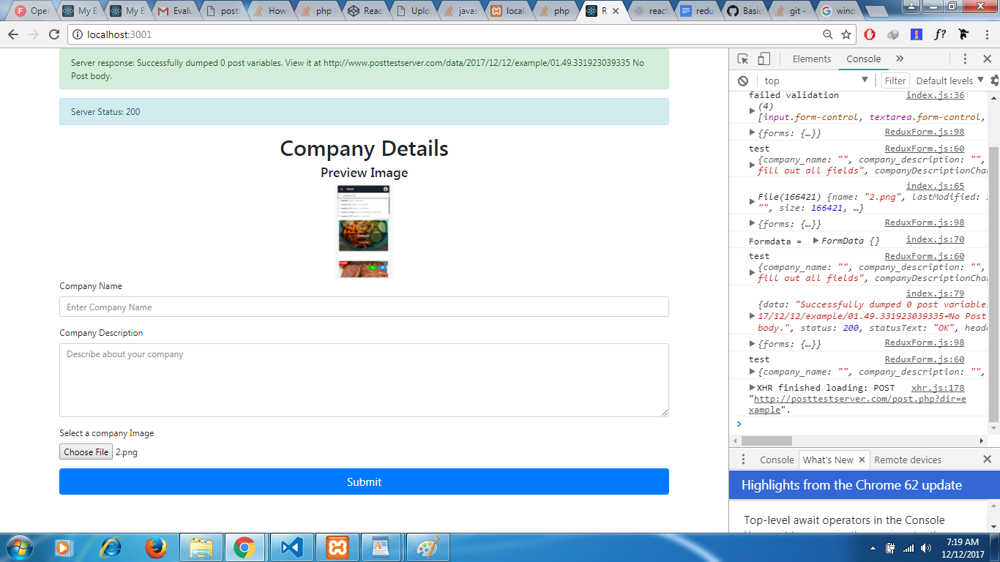
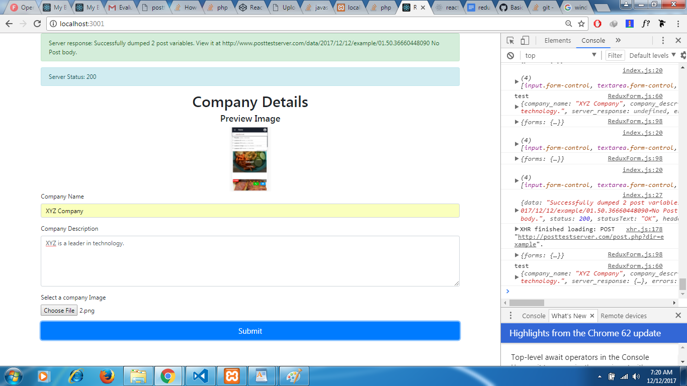
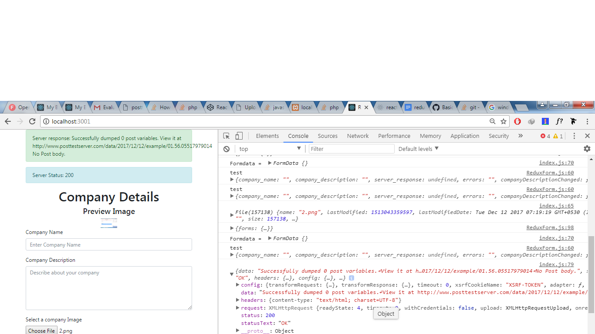
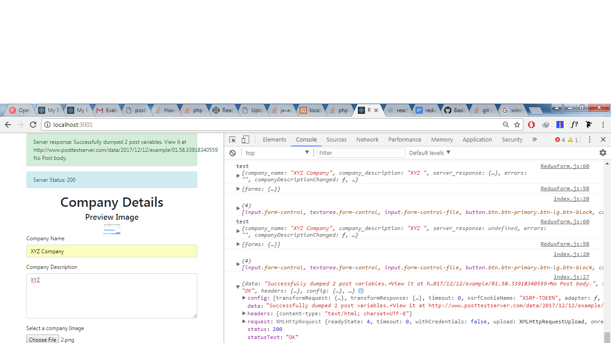

## React Redux Forms Assignment
The assignment involves submitting a form to a test server on clicking submit button and uploading an image when the image is selected to the test server using react redux architecture. 

## libraries involved
### redux
### react-redux
### redux-thunk - for handling asynchronous actions  using redux
### react bootstrap - for styling react components
### axios - for network requests

## Screenshots

####  Form to fill company details with inputs  company name and textarea company description. The form also contains an image upload input which uploads images on selection to server. 

#### Validation if fields are empty

#### The image after selecting will be previewed on screen and will be uploaded. The server data and status can be seen on the screen and console. As you can see status is 200


####  The result after submission of form. The data and status from the server is notified on the screen. As you can see status is 200 and the server received 2 post variables


## Main files
### index.js
import React from 'react';
import ReactDOM from 'react-dom';
import './index.css';
import App from './App';
import registerServiceWorker from './registerServiceWorker';

ReactDOM.render(<App />, document.getElementById('root'));
registerServiceWorker();

### App.js
```javascript
import React, { Component } from 'react';
import { Provider } from 'react-redux';
import { createStore,applyMiddleware } from 'redux';
import ReduxThunk  from 'redux-thunk';
import reducers from './reducers';
import ReduxForm from './Components/ReduxForm';
class App extends Component {
  render() {
    return (
      <Provider store={createStore(reducers,{},applyMiddleware(ReduxThunk))}>
      <div className="App">
       <ReduxForm />
      </div>
      </Provider>
    );
  }
}

export default App;

```
## Components
### Components/ReduxForm.js
```javascript
import React,{Component} from 'react';
import { formSubmitted,companyDescriptionChanged,companyNameChanged,imageUploaded } from '../actions';
import { connect } from 'react-redux'
import { bindActionCreators } from 'redux';
import { Button,Form,FormGroup,Label,Input,FormText,Container,Col,Row,Alert } from 'reactstrap';
class ReduxForm extends Component{
state = {
    file:null
}
    companyNameChange=(text)=>{
        this.props.companyNameChanged(text);
        // console.log(text.target.value)
    }

    companyDescriptionChange=(text)=>{
        this.props.companyDescriptionChanged(text)
        // console.log(text.target.value);
    }

    handleImage=(e)=>{
        // console.log(e.target.files[0]);
        if(e.target.files[0]){
            this.filePreview(e.target.files[0]);
            this.props.imageUploaded(e.target.files[0])
            
        }
    }
filePreview(file){
    const fileReader = new FileReader();

    fileReader.readAsDataURL(file);

    fileReader.onload = (fileEvent)=>{
        this.setState({file:fileEvent.target.result})
    }

}
    submitForm=(e)=>{
        e.preventDefault()
        // console.log()
        
        this.props.formSubmitted(e.target.elements)
        let company_name = e.target.elements.company_name.value;
        let company_description = e.target.elements.company_description.value 
        // this.props.formSubmitted();
        // console.log(`form submitted with company name ${company_name} and company description ${company_description}`);
    }

    render(){
        let error;
     if(this.props.errors){
         error = <div>{this.props.errors}</div>
     }else{
         error = <div></div>
     }
        return(
            
            <div>
                
                {console.log("test",this.props)}
                <Container>

                {this.props.server_response && <Alert color="success">Server response:    {this.props.server_response.data}</Alert>}
                {this.props.server_response && <Alert color="info">Server Status:    {this.props.server_response.status}</Alert>}
                
                <h1 style={{textAlign:"center"}}>Company Details</h1>
                {this.props.errors && <Alert color="danger">{this.props.errors}</Alert>}
                 <div>
                     <h4 style={{textAlign:'center'}}>Preview Image</h4>
                    
                </div>
                <Form  onSubmit={this.submitForm}>
                    <FormGroup>
                        <Label for="company_name">Company Name</Label>
                        <Input type="text" name="company_name" onChange={(event)=>this.companyNameChange(event)}  value={this.props.company_name} placeholder="Enter Company Name"/>
                    </FormGroup>
                    <FormGroup>
                        <Label for="company_description">Company Description</Label>
                <Input type="textarea" name="company_description" rows={5} onChange={(event)=>this.companyDescriptionChange(event)} value={this.props.company_description} placeholder="Describe about your company"/>
                </FormGroup>
                <FormGroup>
                    <Label for="image">Select a company Image</Label>
                     <Input type="file" name="image" onChange={this.handleImage}/>
                </FormGroup>
                <Button color="primary" size="lg" block>Submit</Button>
                </Form>
               
                </Container>
            </div>
        );
    }
}

// const mapDispatchToProps=(dispatch)=>{
// return bindActionCreators({formSubmitted:formSubmitted,companyDescriptionChanged:companyDescriptionChanged,companyNameChanged:companyNameChanged})
// }
const mapStateToProps = (state)=>{
    console.log(state)
    
    return{
        company_name:state.forms.company_name,
        company_description:state.forms.company_description,
        server_response:state.forms.server_response,
        errors:state.forms.errors
    }
}

export default connect(mapStateToProps,{companyDescriptionChanged,companyNameChanged,formSubmitted,imageUploaded})(ReduxForm)
```

## REDUX ACTION CREATORS
### actions/types.js
```javascript
export const FORM_SUBMIT = 'form_submitted';
export const FORM_SUBMT_SUCCESS = 'form_submit_success';
export const FORM_SUBMIT_FAILURE = 'form_submit_failed';
export const COMPANY_NAME_CHANGE = 'company_name_changed';
export const COMPANY_DESCRIPTION_CHANGE = 'company_description_changed';
export const IMAGE_UPLOAD = 'Image_uploaded';
export const IMAGE_UPLOAD_SUCCESS = "image_upload_success";
```

### actions/index.js
```javascript
  import { FORM_SUBMIT,
    FORM_SUBMT_SUCCESS,
    COMPANY_NAME_CHANGE,
    COMPANY_DESCRIPTION_CHANGE,
    IMAGE_UPLOAD,
    IMAGE_UPLOAD_SUCCESS,
    FORM_SUBMIT_FAILURE } from './types';
import axios from 'axios';

export const formSubmitted=(formdata)=>{
    
    return async(dispatch)=>{
        dispatch({type:FORM_SUBMIT})
        const config = {
            headers:{
                'content-type':'application/x-www-form-urlencoded'
            }
        }
        if(formdata.company_name.value.length!==0 && formdata.company_description.value.length!==0){
            console.log(formdata);
        //   console.log("inside validated")
            
        let formData  = new FormData();
        formData.append('company_name',formdata.company_name.value)
        formData.append('company_description',formdata.company_description.value)
        let response = await axios.post(`http://posttestserver.com/post.php?dir=example`,formData,config)
        console.log(response);
    dispatch({
        type:FORM_SUBMT_SUCCESS,
        payload:{
                data:response.data,
                status:response.status
            }
    })
        }else{
            console.log("failed validation",formdata);
            
              dispatch({
        type:FORM_SUBMIT_FAILURE,
        payload:"Please fill out all fields"
    })
        }
    }
  
}

export const companyNameChanged = (text)=>{
    console.log(text)
    return{
        type:COMPANY_NAME_CHANGE,
        payload:text.target.value
    }
}

export const companyDescriptionChanged = (text)=>{
    console.log(text.target.value)
    return{
        type:COMPANY_DESCRIPTION_CHANGE,
        payload:text.target.value
    }
}


export const imageUploaded = (image)=>{
    console.log(image)
    return async(dispatch)=>{
        dispatch({type:IMAGE_UPLOAD})
        const formData = new FormData();
        formData.append('file',image);
        console.log("Formdata = ",formData)
        const config = {
            headers:{
                'content-type':'multipart/form-data'
            }
            
        }

        let response = await axios.post("http://posttestserver.com/post.php?dir=example",formData,config)
        console.log(response)

        dispatch({
            type:IMAGE_UPLOAD_SUCCESS,
            payload:{
                data:response.data,
                status:response.status
            }
    })
    }
}
```

## REDUCERS
### reducers/FormReducer.js
```javascript
import { FORM_SUBMIT,
    FORM_SUBMT_SUCCESS,
    COMPANY_DESCRIPTION_CHANGE,
    COMPANY_NAME_CHANGE,
    IMAGE_UPLOAD,
    IMAGE_UPLOAD_SUCCESS,
    FORM_SUBMIT_FAILURE } from '../actions/types';

const INITIAL_STATE = { company_name:'',company_description:'',server_response:null,errors:""}

export default (state=INITIAL_STATE,action)=>{
    switch(action.type){
        case COMPANY_NAME_CHANGE:
                return {...state,company_name:action.payload}
        case COMPANY_DESCRIPTION_CHANGE:
                return {...state,company_description:action.payload}
        case FORM_SUBMIT:
                return {...state,server_response:action.payload}
        case IMAGE_UPLOAD:
                return {...state,server_response:action.payload}
        case IMAGE_UPLOAD_SUCCESS:
                return {...state,server_response:action.payload,errors:''}
        case FORM_SUBMIT_FAILURE:
                return {...state,errors:action.payload}
        case FORM_SUBMT_SUCCESS:
                return {...state,server_response:action.payload,errors:''}
        default:
            return state
    }
}


```

### reducers/index.js
```javascript
import { combineReducers } from 'redux';
import FormReducer  from './FormReducer';
import 'bootstrap/dist/css/bootstrap.css';
export default combineReducers({
    forms:FormReducer
})
```
## Console Logs




